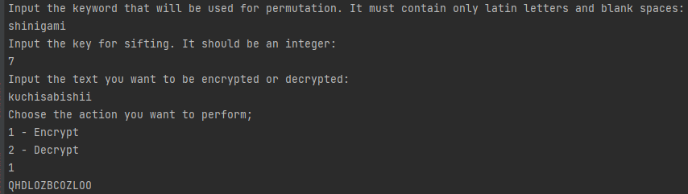
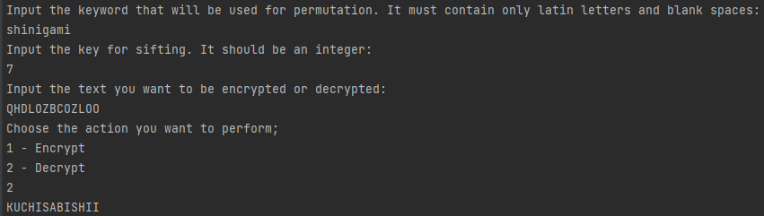
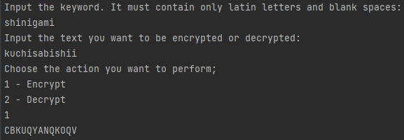
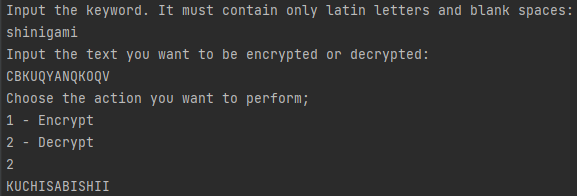
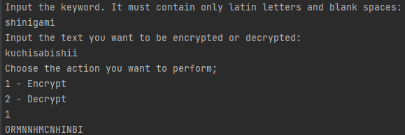
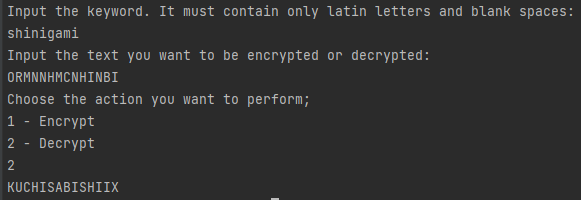
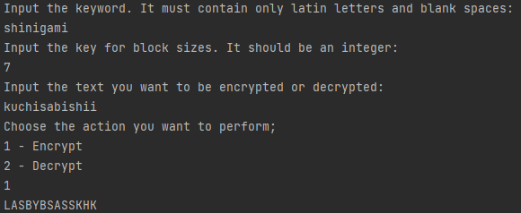
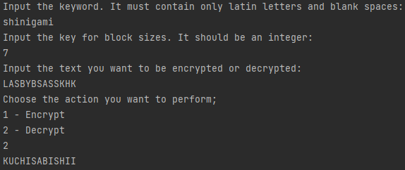

# Topic: Intro to Cryptography. Classical ciphers. Caesar cipher.
### Course: Cryptography & Security
### Author: Graur Elena

----
## Theory
&ensp;&ensp;&ensp; Since ancient times, humanity felt the need to hide important information, 
therefore, it began inventing mechanisms and algorithms that would help it to achieve this goal,
bringing it to the concept of _cipher_. \
&ensp;&ensp;&ensp; Classical ciphers, are the ciphers developed prior to the invention of 
computers. There exists a big variety of ciphers of this kind. However, in this paper, only four
of them will be discussed, namely:
* Caesar Cipher with permutation;
* Vigenere Cipher;
* Playfair Cipher;
* Bifild Cipher.

&ensp;&ensp;&ensp; Before going forward, a brief explanation of each one's logic will be presented.\
&ensp;&ensp;&ensp; So, to implement Caesar Cipher with permutation, it is needed to have a keyword
(a string with m characters), a key (a natural number, which is different from 0) and the text 
itself. First, the permuted alphabet should be obtained, therefore, the first letters in the used 
alphabet will be the letters from the keyword, without repetitions. After this, all the remaining
letters from alphabet that were not present in the keyword, are written in their natural order. 
The only remaining thing is to perform a shift to change letters. For this purpose, the following
formula are used:
* (_i_ + _k_) mod 26, for encryption;
* (_i_ - _k_) mod 26, for decryption;

where _i_ is the order of the letter and _k_ is the chosen key. \
&ensp;&ensp;&ensp; Basically, for Vigenere Cipher, it is needed for a matrix of the size 26 by 26,
where each entry represents a letter of english alphabet in order of its appearance. In the 
interior, the matrix is filled with alphabet, shifted cyclically to the left compared to the 
previous alphabet, meaning that it begins with the entry letter from the row. To perform any
actions, it is needed to have a keyword. In case of encryption, the letter is replaced by the
intersection of the letter from the plain text (row) and the one from keyword (column). For 
decryption, it will be necessary to find the letter from the plain text in the column of the
keyword letter and to write down the letter which corresponds to its row. However, the following
formula may be used:
* (_t[i]_ + _k[i]_) mod 26, for encryption;
* (_t[i]_ - _k[i]_ + 26) mod 26, for decryption;

where _t[i]_ is the index of the letter from plain text and _k[i]_ is index of the current letter
from the keyword.\
&ensp;&ensp;&ensp; Another cipher presented in this laboratory work is Playfair Cipher. It uses
a matrix 5 by 5, usually replacing 'J' with 'I' and filled with the english alphabet letters,
such as starting with the first row, matrix is filled with letters from the keyword, in order
of their appearance, without repetitions, After that, all the remaining letters are added in their
natural order. To encrypt a plain text using this cipher, it should be divided into blocks by two,
taking into account the following rules:
* if there are the same letters in one block, add a fill letter and split this block into two
different blocks;
* if there is no pair for the last letter, add a fill letter to form a group of two.

After the text is splitting as explained above, it should be encrypted as follows:
* if the letters from one group are in the same row, replace each of them the with the letter 
from one position right (go to the beginning if it is in the last column);
* if the letters from one group are in the same column, replace each of them the with the letter 
from one position lower (go to the beginning if it is in the last row);
* make a rectangle using letters as two of its corners and replace the current letter with the 
letter from the opposite corner.

For decryption the same procedures are done, but in case of the same row, the element from the left
is chosen and, in case of the same column - the one that is upper by a unit.\
&ensp;&ensp;&ensp; The last, but not the least algorithm is the Bifid Cipher. For its 
implementation, it is needed to construct a 5 by 5 matrix like the one described for Playfair
Cipher. The text is divided in chunks of key size. After this, there are created two lists,
one that keeps the row matrix index of the letter and, the other one, that keeps the column
index. After this, the indexes of the same group are merged. To obtain the letters for the 
encrypted text, it will be taken indexes from groups, in order of their appearance, as the
row and column index of the new letter. To decrypt this cipher, instead of merging the groups,
it is necessary to split the chunks of size _key * 2_ in two equal groups and write down a letter
with row index from the first group and column index from the second one.

## Objectives:
1. Get familiar with the basics of cryptography and classical ciphers.
2. Implement 4 types of the classical ciphers:
    - Caesar Cipher with one key used for substitution (as explained above);
    - Caesar Cipher with one key used for substitution, and a permutation of the alphabet;
    - Vigenere Cipher;
    - Playfair Cipher.
    - Other.
3. Structure the project in methods/classes/packages as needed.

## Implementation description
&ensp;&ensp;&ensp; The main goal of this laboratory work is to get familiar with classical 
ciphers by implementing four of these in a chosen programming language. In this specific
laboratory work implementation, you may find the following ciphers, each implemented in separate
class, written in separate python files:
* Caesar Cipher with permutation (_CaesarCipherPermutation_ class);
* Vigenere Cipher (_VigenereCipher_ class);
* Playfair Cipher (_PlayfairCipher_ class);
* Bifid Cipher (_BifidCipher_ class).

&ensp;&ensp;&ensp; Despite the classes mentioned above, that will be described later, there are 
two more files. \
&ensp;&ensp;&ensp; In the _main.py_, the program is initiated. Class _Control_, that can be found
in _Control.py_, ensure the interation between the user and the program, giving the following 
opportunities by the methods:
* _get_cipher()_ - user chooses the cipher he/she wants to use;
````python
def get_cipher(self):
    print('Choose the number that corresponds to th cipher you want use:\n'
            '1 - Cesar Cipher with permutation\n'
            '2 - Vigenere Cipher\n'
            '3 - Playfair Cipher\n'
            '4 - Bifid Cipher')
    cipher = int(input())
    if cipher not in range(1, 5):
        raise Exception('You should choose an integer between 1-4')
    return cipher
````
* _get_action()_ - user chooses either he/she wants to encrypt or decrypt the plaintext.
````python
def get_action(self):
    print('Choose the action you want to perform;\n'
            '1 - Encrypt\n'
            '2 - Decrypt')
    action = int(input())
    if action not in range(1, 3):
        raise Exception('You should choose an integer between 1-2')
    return action
````
All classes that describe cipher implementation, have 3 main common methods that are:
* ___get_input_data()_ - private method that reads the user input for the text to be changed, 
keyword and key if it is the case;
* _encode_text()_ - public method encrypt the input plain text;
* _decode_text()_ - public method decrypt the input plain text.

Mainly, the _encode_text()_ and _decode_text()_ methods will be discussed for each class 
individually, only bringing other methods in case they will contribute to logic understanding.
For more detailed explanations of these methods, please take a look at the code, where they are
provided in commentary sections.\
&ensp;&ensp;&ensp; For Caesar Cipher, first, the ___get_permuted_alphabet()_ is called,  to 
transform the normal alphabet into the one that begins with the keyword.
````python
def __get_permuted_alphabet(self):
    for letter in self.normal_alphabet:
        if letter not in self.alphabet:
            self.alphabet.append(letter)
````
After this, either the encoder or decoder method is called, where the methods that perform 
changes in alphabet are called and the formula described in the theory part is called, as it
may be observed in the code presented below.
````python
def encode_text(self):
    self.__prepare_components()
    encoded_word = ''
    for i in self.word:
        encoded_word += self.alphabet[(self.normal_alphabet.index(i) + self.shift_key) % 26]
    return encoded_word
````
````python
def decode_text(self):
    self.__prepare_components()
    decoded_word = ''
    for i in self.word:
        decoded_word += self.normal_alphabet[(self.alphabet.index(i) - self.shift_key) % 26]
    return decoded_word
````
&ensp;&ensp;&ensp; In case of Vigenere Cipher class, like in other classes, the keyword and plain
text are transformed to a normal form by removing all blank spaces and make all letters uppercase.
After that, in dependence of the user input, the encryption or decryption is performed, using
the formulas described in the theory.
````python
def encode_text(self):
    self.word = self.__set_word(self.word)
    self.keyword = self.__set_word(self.keyword)
    keyword_length = len(self.keyword)
    encoded_text = ''
    k = 0
    for i in self.word:
        word_letter_index = self.normal_alphabet.index(i)
        keyword_letter_index = self.normal_alphabet.index(self.keyword[k % keyword_length])
        encoded_text += self.normal_alphabet[(word_letter_index + keyword_letter_index) % 26]
        k += 1
    return encoded_text
````
````python
def decode_text(self):
    self.word = self.__set_word(self.word)
    self.keyword = self.__set_word(self.keyword)
    keyword_length = len(self.keyword)
    decoded_text = ''
    k = 0
    for i in self.word:
        word_letter_index = self.normal_alphabet.index(i)
        keyword_letter_index = self.normal_alphabet.index(self.keyword[k % keyword_length])
        decoded_text += self.normal_alphabet[(word_letter_index - keyword_letter_index + 26) % 26]
        k += 1
    return decoded_text
````
&ensp;&ensp;&ensp; For the Playfair Cipher, it is necessary to build a 5 by 5 matrix. For this 
purpose, first an array with the order of appearance of letters is build in a similar way with 
the Caesar Cipher with permutation, excluding "J". Then, this list is used to fill the matrix 
row by row.
````python
def __build_matrix(self):
    self.__set_keyword()
    self.__get_permuted_alphabet()
    k = 0
    for i in range(5):
        for j in range(5):
            self.matrix[i][j] = self.alphabet[k]
            self.dictionary[self.alphabet[k]] = [i, j]
            k += 1
````
For encryption or decryption, the letters are added in groups by two (as they are divided). The 
indexes of letters are kept into a dictionary, that is filled at the same time as matrix is build.
The indexes of the new letters are chosen according to the rules described in theory part.
````python
def encode_text(self):
    encoded_text = ''
    self.__separate_plain_text()
    self.__build_matrix()
    for block in self.processed_word:
        letter_1, letter_2 = block
        row_1, column_1 = self.dictionary[letter_1]
        row_2, column_2 = self.dictionary[letter_2]
        if row_1 == row_2:
            encoded_text += self.matrix[row_1][(column_1 + 1) % 5] + self.matrix[row_2][(column_2 + 1) % 5]
        elif column_1 == column_2:
                encoded_text += self.matrix[(row_1 + 1) % 5][column_1] + self.matrix[(row_2 + 1) % 5][column_2]
        else:
            encoded_text += self.matrix[row_1][column_2] + self.matrix[row_2][column_1]
    return encoded_text
````
````python
def decode_text(self):
    decoded_text = ''
    self.__group_plain_text()
    self.__build_matrix()
    for block in self.processed_word:
        letter_1, letter_2 = block
        row_1, column_1 = self.dictionary[letter_1]
        row_2, column_2 = self.dictionary[letter_2]
        if row_1 == row_2:
            decoded_text += self.matrix[row_1][(column_1 - 1) % 5] + self.matrix[row_2][(column_2 - 1) % 5]
        elif column_1 == column_2:
            decoded_text += self.matrix[(row_1 - 1) % 5][column_1] + self.matrix[(row_2 - 1) % 5][column_2]
        else:
            decoded_text += self.matrix[row_1][column_2] + self.matrix[row_2][column_1]
    return decoded_text
````
&ensp;&ensp;&ensp; As in the case of Playfair Cipher, the Bifid Cipher needs a 5 by 5 matrix, 
that is built in a similar way. Also, another similar aspect of these two ciphers is that tha 
plain text should be split and divided into groups, exception being the fact that user defines 
group size. The division happens in the way described in the theory part. For convenience, the 
indexes of the letters are kept in a dictionary. Nonetheless, there are defined two different 
methods for splitting text in case of encoding and decoding, as, in case of the first one it is 
needed to merge the row and the column indexes, while for the second one - to split these two 
entities.
````python
def __get_encoding_blocks(self):
    blocks = [self.word[i:i + self.key] for i in range(0, len(self.word), self.key)]
    rows = [[] for i in range(len(blocks))]
    columns = [[] for i in range(len(blocks))]
    encoded_blocks = [[] for i in range(len(blocks))]
    i = 0
    while i < len(blocks):
        block = blocks[i]
        for letter in block:
            rows[i].append(self.dictionary[letter][0])
            columns[i].append(self.dictionary[letter][1])
        encoded_blocks[i] = rows[i] + columns[i]
        i += 1
    return encoded_blocks
````
````python
def __get_decoding_blocks(self):
    blocks = [self.word[i:i + self.key] for i in range(0, len(self.word), self.key)]
    rows = [[] for i in range(len(blocks))]
    columns = [[] for i in range(len(blocks))]
    decoding_blocks = [[] for i in range(len(blocks))]
    i = 0
    while i < len(blocks):
        block = blocks[i]
        for letter in block:
            decoding_blocks[i] += self.dictionary[letter]
        split = len(decoding_blocks[i]) // 2
        rows[i] = decoding_blocks[i][:split]
        columns[i] = decoding_blocks[i][split:]
        i += 1
    return rows, columns
````
For the methods that encrypts and decrypts the plain text, methods that prepare all other
components are initiated and the new letters are obtained by selecting the value from the matrix
according to the rules described in the theory part.
````python
def encode_text(self):
    self.__build_matrix()
    self.word = self.__set_word(self.word)
    encoded_blocks = self.__get_encoding_blocks()
    encoded_text = ''
    for block in encoded_blocks:
        i = 0
        while i < len(block):
            row = block[i]
            column = block[i + 1]
            encoded_text += self.matrix[row][column]
            i += 2
    return encoded_text
````
````python
def decode_text(self):
    self.__build_matrix()
    self.word = self.__set_word(self.word)
    rows, columns = self.__get_decoding_blocks()
    decoded_text = ''
    for i in range(len(rows)):
        for j in range(len(rows[i])):
            row = rows[i][j]
            column = columns[i][j]
            decoded_text += self.matrix[row][column]
    return decoded_text
````

## Results
&ensp;&ensp;&ensp; In this section, it will be provided an example of how each algorithm
described above works and what output it gives. As the input data, it will be used:
* for keyword - *_shinigami_;
* for key - _7_;
* for plain_text- **_kuchisabishii_, for encryption and the encrypted version in the given cipher
for decryption.

The results for each type of cipher are the following:
* Caesar Cipher with permutation:




* Vigenere Cipher:




* Playfair Cipher (note that here, the after the decryption there is an additional letter at the 
end due to adding fill letters in encryption phase):




* Bifid Cipher:




## Conclusions 
&ensp;&ensp;&ensp; Classical ciphers are mostly mono-alphabetic or poly alphabetic ciphers
that operates with shifting or permutation. They range in complexity from very simple to 
very complex. However, even if some of them seems to be complex, their use can be resumed to
entertaining, as even a not so good computer is able to break every classical cipher relatively
easy. Nonetheless, they are important to know for a better understanding of the modern ciphers.