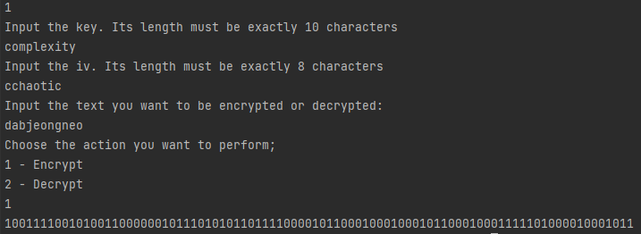
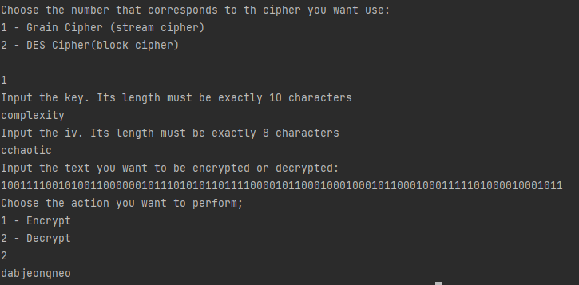
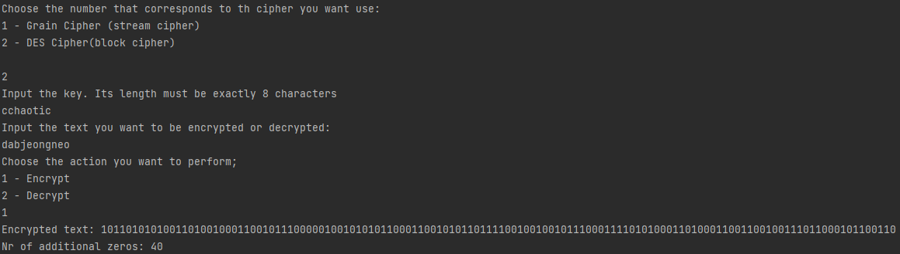
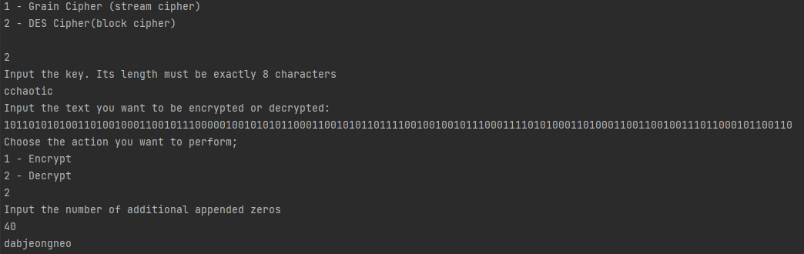

# Topic: Symmetric Ciphers. Stream Ciphers. Block Ciphers.

### Course: Cryptography & Security
### Author: Graur Elena

----

## Theory
&ensp;&ensp;&ensp; Symmetric cryptography is one field of the modern cryptography. One of the most notorious 
characteristics of this type of ciphers is the presence of the private key, which is the same for encryption and 
decryption.\
&ensp;&ensp;&ensp; Within the symmetric ciphers, it is possible to distinguish two main types: block ciphers and stream
ciphers. The difference between these two variations of symmetric cryptography is the fact that, in case of stream 
ciphers, the text is encrypted or decrypted character by character, while in the block ciphers - it is grouped in 
blocks and all actions are performed over the resulted blocks.\
&ensp;&ensp;&ensp; As an example of stream cipher, it may be considered the _Grain Cipher_. This cipher was publicly 
presented in 2004 and is mostly designed for restricted hardware. Its specific is the presence of an 80-bit key and a 
64-bit IV (initialization vector), with an 80-bit linear feedback shift register (LFSR) and 80-bit non-linear feedback 
shift register (NLFSR). To initialize the cipher, the key is loaded directly into non-linear feedback register, while the
IV is loaded into linear feedback register, the remaining space being filled with ones. Then, 160 clockings are 
performed, during which LFSR and NLFSR are updated, but no keystream is released. The process of encryption or 
decryption itself consists of output a combination of four bits of LFSR and 1 bit of NLFSR at each iteration, while 
shifting both registers by one bit each time. \
&ensp;&ensp;&ensp; Data encryption standard (DES) is an example of block ciphers. It uses a 64-bit key that, after some
transformations, becomes 56-bit key, the bits 8, 16, 24, 32, 40, 48, 56 and 64 being discarded. The algorithm itself is
based on two principles: confusion (substitution) and diffusion (transposition). There are 16 rounds that performs the 
principles mentioned above.Moreover, in the first step, the text is handed over the initial permutation (IP).
After this, the initial permutation IP is performed over the text and split the block into two halves. Each of the 
halves suffers the 16 rounds encryption (decryption) process and are rejoined together according to the final 
permutation block (FP), resulting into a 64-bit block of ciphertext.


## Objectives
1. Get familiar with the symmetric cryptography, stream and block ciphers.
2. Implement an example of a stream cipher.
3. Implement an example of a block cipher.
4. The implementation should follow the abstraction/contract/interface used in the previous 
5. laboratory work.
6. Use packages/directories to logically split the files that you will have.
7. Use a client class or test classes to showcase the execution of your programs.

   
## Implementation description
&ensp;&ensp;&ensp; During this laboratory work, the main goal was to get familiar with symmetric
ciphers. In order to achieve this, there was proposed to implement one type of stream ciphers and
one of block ciphers. As follows, the ciphers listed below was chosen:
* Grain Cipher (stream cipher);
* DES Cipher (block cipher).

&ensp;&ensp;&ensp; The above-mentioned components are located into a dedicated directory, 
_stream_ciphers_. Beside the ciphers themselves, it contains a common class 
_StringTransformer_, to manage conversion to binary and vice-versa, as well as a _Control_ class
for user communication perspective. Further, each component added for the current laboratory
work will be described and analyzed.

&ensp;&ensp;&ensp; The _Control_ class consists only of two methods:
* _get_cipher()_ - to specify the cipher the one wants to use;
````python
def get_cipher(self):
    print('Choose the number that corresponds to th cipher you want use:\n'
            '1 - Grain Cipher (stream cipher)\n'
            '2 - DES Cipher(block cipher)\n')
    cipher = int(input())
    if cipher not in range(1, 3):
        raise Exception('You should choose an integer between 1 and 2')
    return cipher
````
* _get_action()_ - to specify if the process of encryption or decryption is willing to be 
performed.
````python
def get_action(self):
    print('Choose the action you want to perform;\n'
            '1 - Encrypt\n'
            '2 - Decrypt')
    action = int(input())
    if action not in range(1, 3):
        raise Exception('You should choose an integer between 1 and 2')
    return action
````

&ensp;&ensp;&ensp; Going forward, let us discuss the _StringTransformer_ class. It, as well, 
consists of two methods. The first method, _convert_text_to_bit()_, read each character of the 
input string and convert it into its binary representation, until the whole text is in bits form.
````python
def convert_text_to_bit(self, input_string, encoding='utf-8'):
    binary_text = ''.join(format(i, '08b') for i in bytearray(input_string, encoding))
    return binary_text
````

&ensp;&ensp;&ensp; The second method of the described class, _convert_bit_o_text_, has the opposite purpose, 
therefore it transforms a binary sequence into a plain text representation.
````python
def convert_bit_to_text(self, binary_string, encoding='utf-8', errors='surrogatepass'):
    decimal_binary_value = int(binary_string, 2)
    nr_byte = decimal_binary_value.bit_length() + 7 // 8
    binary_array = decimal_binary_value.to_bytes(nr_byte, 'big')
    return binary_array.decode(encoding, errors)
````

&ensp;&ensp;&ensp; Further, the symmetric ciphers' implementation  will be discussed. Note that
during this description in the current report, it will be provided only a succinct explanation
of implementation and the most important parts will be explained. Please, in case more code
explanation is needed, take a look over the source code itself, as there are provided explanatory
comments to each unit of code. \
&ensp;&ensp;&ensp; Taking into account everything mentioned above, let us start with 
_**Grain Cipher**_ implementation description. As it was mentioned in the theory part, the first
step to perform this algorithm is linear and non-linear feedback shift registers initialization. 
In this step, the initial vector is loaded as the initial state of the LFSR, the remaining
space being filled with 1's. The NLFSR register is initiate with the key.
````python
def __initiate_lfsr_nfsr(self):
    binary_iv = self.transformer.convert_text_to_bit(self.iv)
    binary_key = self.transformer.convert_text_to_bit(self.key)
    binary_iv_len = len(binary_iv)
    binary_key_len = len(binary_key)
    self.lfsr[:64] = [bool(int(binary_iv[i])) for i in range(binary_iv_len)]
    self.lfsr[64:] = 1
    self.nfsr[:] = [bool(int(binary_key[i])) for i in range(binary_key_len)]
````

&ensp;&ensp;&ensp; The filter function is updated performing logical operations between some 
bits of registers: four bits are taken from LFSR and 1 from NLFSR. The main goal of this function
is to generate the sequence that, eventually, will directly participate in logical operations with 
the input text. 

````python
def __update_register(self, fx, gx):
    x0 = self.lfsr[0]
    x1 = self.lfsr[25]
    x2 = self.lfsr[46]
    x3 = self.lfsr[64]
    x4 = self.nfsr[63]
    hx = x1 ^ x4 ^ x0 & x3 ^ x2 & x3 ^ x3 & x3 ^ x0 & x1 & x2 ^ x0 & x2 & x3 ^ \
        x0 & x2 & x4 ^ x1 & x2 & x4 ^ x2 & x3 & x4
    self.lfsr[:-1] = self.lfsr[1:]
    self.nfsr[:-1] = self.nfsr[1:]
    self.lfsr[-1] = fx
    self.nfsr[-1] = gx
    return hx
````
During the same step, the registers are updating themselves, by shifting one bit to the left.

&ensp;&ensp;&ensp; To encrypt or decrypt the text, first, all components should be initiated. After this, a 160 
clocking should be performed, only to update registers, not taking into account stream 
generation. Then, the stream itself should be generated to xor it with each bit of the input text.

````python
def encrypt_text(self):
    text = self.transformer.convert_text_to_bit(self.text)
    self.__initiate_lfsr_nfsr()
    self.__clock()
    stream = self.__generate_key_stream()
    encrypted_text = [str(int(bool(int(text[i])) ^ next(stream))) for i in range(len(text))]
    encrypted_text = ''.join(encrypted_text)
    return encrypted_text
````

Basically, the encryption and decryption processes are the same, the only difference being the 
logic of dealing with text itself, in other words, to convert it into binary format or to 
the Unicode standard.

````python
def decrypt_text(self):
    self.__initiate_lfsr_nfsr()
    self.__clock()
    stream = self.__generate_key_stream()
    decrypted_text = [str(int(bool(int(self.text[i])) ^ next(stream))) for i in range(len(self.text))]
    decrypted_text = ''.join(decrypted_text)
    try:
        decrypted_text = self.transformer.convert_bit_to_text(decrypted_text)
    except:
        raise Exception(f'It seems the given data is incorrect')
    return decrypted_text
````

&ensp;&ensp;&ensp; The next cipher to be analyzed is the Data Encryption Standard (DES). As it 
may be deduced from the category of the cipher, block ciphers, the bits resulted from the text 
conversion, should be grouped in blocks. The size of such a block is 64-bit. The method 
_group_in_blocks()_ deals with this situation. Also, if there are no sufficient bits for a block 
of 64 bits, it is completed with 0's.

````python
def __group_in_blocks(self, block):
    block_list = []
    zero_counter = 0
    if len(block) % 64 != 0:
        for i in range(64 - (len(block) % 64)):
            zero_counter += 1
            block += '0'
    for i in range(len(block) // 64):
        block_list.append(block[i * 64: i * 64 + 64])
    return block_list, zero_counter
````

&ensp;&ensp;&ensp;  DES is more about confusion and diffusion, that is why there is several times when the replacement
of bits is needed. Therefore, there exists a method _replace_block()_ that accepts as parameter
the block itself and the pattern it should be modified as, to perform all needed substitutions.

````python
def __replace_block(self, block, box):
    initial_replaced_block = ''
    for i in box:
        try:
            initial_replaced_block += block[i - 1]
        except IndexError:
            raise Exception(f'Cannot access index {i - 1} in {block} with the length: {len(block)}')
    return initial_replaced_block
````

&ensp;&ensp;&ensp; As there exists certain arrangement of how the block should be rearranged for
each step, there exists a helper file _utils.py_, that contains all patterns needed for DES
implementation.

&ensp;&ensp;&ensp; An important fact that should be mentioned is that the key is on the length of 56 bits. The 
original key input requested is of 64-bits (8 characters), but every bit on the 8th position is 
discarded.
````python
def __reduce_key(self, key):
    return self.__replace_block(key, REDUCED_KEY)
````

&ensp;&ensp;&ensp; Nonetheless, the algorithm operates with subkeys. Tere are 16 subkeys generated.They are created from
the original key, which is split in half, each having 28 bits. Each of the halves is shifted left by one or two bits
each round, and then 24 bits from each are selected and grouped together to obtain a subkey.

````python
    def __get_subkeys(self, key):
        subkeys = []
        compressed_key = self.__reduce_key(key)
        left, right = compressed_key[0: 28], compressed_key[28: 56]
        for i in range(16):
            left_spin = left[ROUND[i]:] + left[:ROUND[i]]
            right_spin = right[ROUND[i]:] + right[:ROUND[i]]
            subkeys.append(left_spin + right_spin)
        return subkeys
````

````python
def __compress_subkey(self, subkeys):
    compressed_subkeys = []
    for subkey in subkeys:
        compressed_subkeys.append(self.__replace_block(subkey, SUBKEY_BOX))
    return compressed_subkeys
````

&ensp;&ensp;&ensp; The encryption and decryption processes use the same algorithm with minor changes. Therefore, there
exists a dedicated method which describes the algorithm itself.

````python
def __get_encrypt_decrypt_algorithm(self, blocks, key, is_encryption):
    result = ''
    compressed_subkeys = self.__get_compressed_subkeys(key, is_encryption)
    for block in blocks:
        initial_result = self.__replace_block_initial(block)
        block_result = self.__round_iterate(initial_result, compressed_subkeys)
        block_result = self.__replace_final_block(block_result)
        result += block_result
    return result
````

&ensp;&ensp;&ensp; In the encryption and decryption methods, only some additional text manipulations are performed and
the algorithm presented below is called.

````python
def encrypt_text(self):
    binary_text = self.transformer.convert_text_to_bit(self.text)
    key = self.transformer.convert_text_to_bit(self.key)
    blocks, nr_zero_addition = self.__group_in_blocks(binary_text)
    encrypted_text = self.__get_encrypt_decrypt_algorithm(blocks, key, True)
    return f'Encrypted text: {encrypted_text} \nNr of additional zeros: {nr_zero_addition}'
````

The _decrypt_text()_ method also requires the number of zeros added in the encryption process, to ensure a right output.

````python
def decrypt_text(self):
    self.__get_nr_zero_addition()
    blocks = self.__group_in_blocks(self.text)[0]
    key = self.transformer.convert_text_to_bit(self.key)
    binary_decrypted_text = self.__get_encrypt_decrypt_algorithm(blocks, key, False)
    if self.nr_zero_addition > 0:
        binary_decrypted_text = binary_decrypted_text[:-self.nr_zero_addition]
    try:
        decrypted_text = self.transformer.convert_bit_to_text(binary_decrypted_text)
    except:
        raise Exception(f'I seems the given data is incorrect')
    return decrypted_text
````

## Results
&ensp;&ensp;&ensp; In this section, it will be provided an example of how each algorithm 
described above works and what output it gives. As the input data, it will be used:
* 'cchaotic' as the iv for the _Grain Cipher_ and the key fo _DES Cipher_;
* 'complexity' - as the key for _Grain Cipher_;
* 'dabjeongneo'* - as the plaintext;
* the results of both algorithms' encryption as the ciphertext for each of them, respectively.

The obtained results are the following:
* _Grain Cipher_




* _DES_




## Conclusions 
&ensp;&ensp;&ensp; Symmetric ciphers are one of the types of modern ciphers. Their specific, as 
it could be observed during this laboratory work, is the presence of a private key. It is the 
same for both: encryption end decryption; here comes the name of "symmetric". It could be 
observed that in many cases, the encryption and decryption processes use almost the same
algorithm to perform computations. Overall, it can be stated that the types of ciphers 
analyzed during this laboratory work are quite safe. The issue that may occur during their usage
is the privacy and safety of the key.

----
*_dabjeongneo_ - (from Korean) it means the situation when the answer is already determined, 
and you just need to give that answer

