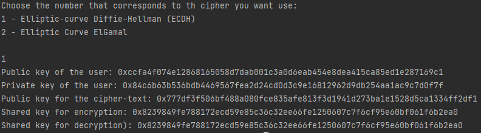
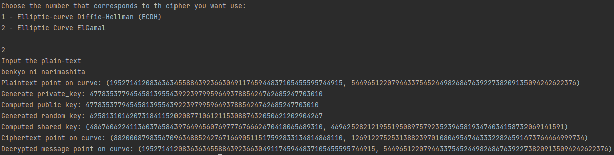

# Topic: Asymmetric Ciphers.

### Course: Cryptography & Security
### Author: Graur Elena

----

## Theory
&ensp;&ensp;&ensp; Asymmetric cryptography, known also as Public-key cryptography, is the newest field in the modern
cryptography. On board terms, it uses all power of modular Mathematics to encrypt or decrypt a message. \
&ensp;&ensp;&ensp; Basically, asymmetric ciphers use two keys: private key and public key. The private key 
(a.k.a. secret key) is known only by the person who wants to send a message, in other words by the owner. Meanwhile, 
the public key is available for everyone and may be used to encrypt the message for its owner. \
&ensp;&ensp;&ensp; One of the most trivial examples of public-key cryptography algorithms is Rivest–Shamir–Adleman 
(RSA)cryptographic algorithm. However, nowadays, there are alternative approaches that include elliptic curve 
cryptography, as well. \
CAs it may be deduced from the name, Elliptic Curve cryptography is based on mathematics of 
elliptic curves  a type of cubic curve whose solutions are confined to a region of space that is topologically 
equivalent to a torus. In encryption purposes, this approach may be used by itself, as well as in combination with
other existing approaches. For example, consider the basic Diffie-Hellman key exchange. Its algorithm is pretty
simple and have the following steps:
* Alice and Bob* agree on two public numbers g, p;
* Each of them selects a private key;
* Alice computes the public key values as (g ^ private_key) mod p (publickey);
* They compute the shared key as (received_public_key ^ private_key) mod p.

If all the computations are done correctly, the obtained shared key should be
the same for both Alice and Bob. The elliptic curves introduces changes in public key
generation as it becomes a point on the agreed elliptic curve field by multiplying 
generated private key with the base point of the elliptic curve. Despite the classic algorithm,
in this one the shared key is computed as product of the receiver's private key and the
sender's public key. \
&ensp;&ensp;&ensp; Another usage of elliptic curves is in ElGamal algorithm. In this approach, a person
sets a random private key less or equal to the order of the chosen elliptic
curve. The public key is computed as the product of the private key and the
curve base point. To send a message, sender generates a random encryption key. Then
he/she multiplies this key with the receiver's public key (point on the curve). After
this, the point representation of the plaintext (multiplied by the base point of the curve)
is added to the product computed earlier. In this way, the point representation of
the ciphertext is obtained and, basically, the message is encrypted. \
&ensp;&ensp;&ensp; To decrypt the message, the receiver compute shared key by multiplies his/her private key
value with the poit representation of the random key in the elliptic curve field.
The point representation of the message is obtained by subtracting the obtained shared key from
the received ciphertext coordinates. In order to transform it into text representation, it 
may be used BruteForce algorithm or "Baby step giant step" algorithm to find the matching through all eligible numbers,
by checking their point representation with the decrypted one.

## Objectives
1. Get familiar with the asymmetric cryptography mechanisms.

2. Implement an example of an asymmetric cipher.

3. Use a client class or test classes to showcase the execution of programs.

## Implementation description
&ensp;&ensp;&ensp; During this laboratory work, the main goal was to get familiar with asymmetric ciphers. In order 
to achieve this, there was proposed to implement one type of asymmetric cipher. The following ciphers were implemented:
* Elliptic-curve Diffie–Hellman cipher (ECDH)
* Elliptic Curve ElGamal cipher.

&ensp;&ensp;&ensp; The implementation of the ciphers listed above is located in _asymmetric_ciphers_ directory, in _cipher_implementation_
folder of the _implementation_. Notice the fact that, despite the ciphers themselves implementation, there is also 
the _StringTransformer_ class, as in the previous laboratory work, with a new method that describes the text 
transformation into integer. \
&ensp;&ensp;&ensp; As usual, there is a _Control_ class that describes the user's interaction with the system.
File _ec_operations_ hosts _EllipticCurveOperations_ class, where the operations in the curve field are described.
Actually, there are two methods that should be discussed. First one is the elliptic curve point addition, which applies
basic formula to add two points on the elliptic curve.

````python
def add_points(self, x1, y1, x2, y2, a, mod):
    if x1 == x2 and y1 == y2:
        temp = (3 * x1 ** 2 + a) * (self.__get_modular_inverse(2 * y1, mod))
    else:
        temp = (y2 - y1) * (self.__get_modular_inverse((x2 - x1), mod))

    result_x = temp ** 2 - x2 - x1
    result_y = temp * (x2 - result_x) - y2
    result_x = result_x % mod
    result_y = result_y % mod

    while result_x < 0:
        result_x += mod
    while result_y < 0:
        result_y += mod

    return result_x, result_y
````

The other method the class provides is the multiplication of a point of the curve by a scalar value. It applies
"Double and Add" algorithm to perform the calculation in polynomial time. More details about the algorithm may be
found [here](https://www.youtube.com/watch?v=u1VRbo_fhC8).

````python
def apply_double_addition_algorithm(self, x, y, k, a, mod):
    temp_x = x
    temp_y = y
    k = k[2:len(k)]
    for i in range(1, len(k)):
        current_bit = k[i]
        temp_x, temp_y = self.add_points(temp_x, temp_y, temp_x, temp_y, a, mod)
        if current_bit == '1':
            temp_x, temp_y = self.add_points(temp_x, temp_y, x, y, a, mod)
    return temp_x, temp_y
````

&ensp;&ensp;&ensp; To ease the process of work, the pre-defined curves from _tinyec_ library are used. Nonetheless, in 
case of random number generation, the _secrets_ library was used, as, unlike the classical _random_, it provides 
cryptography secure random numbers.\
&ensp;&ensp;&ensp; Note that the following part describes the ECDH implementation, which has no directed attribution to the laboratory 
work itself and was added only on author's whim. You may skip it and go directly [here](#elliptic-curve-elgamal). \
&ensp;&ensp;&ensp;  So, as it was mentioned in the theory, the first step is to generate a private key. The key is generated random 
between the values of 0 and the order of the selected curve. 

````python
def __set_private_key(self):
    private_key = secrets.randbelow(self.curve.field.n)
    return private_key
````

After this, the public key is generated, using the curve and the private key that was just generated.

````python
def __set_public_key(self, private_key):
    public_key = private_key * self.curve.g
    return public_key
````

After both keys are set, the encryption or decryption process may occur. The implementation is pretty straightforward
as it implies only implementation of the formulas specified in the theory part.

````python
def encrypt_key(self):
    ciphertext_private_key = secrets.randbelow(self.curve.field.n)
    ciphertext_public_key = ciphertext_private_key * self.curve.g
    shared_key = ciphertext_private_key * self.public_key
    return shared_key, ciphertext_public_key
````

````python
def decrypt_key(self, cipher_text_public_key):
    shared_key = cipher_text_public_key * self.private_key
    return shared_key
````

&ensp;&ensp;&ensp; As a result of encryption process, a shared key and an encrypted message are obtained. In case the shared key is the 
same as in decryption, it means the implementation is a success and a secret is encrypted correctly. Basically, this
algorithm is mostly used in combination with a symmetric cipher, as it encrypts a secret shared key that should be
the same for both sender and receiver, then applying a symmetric cipher to encrypt or decrypt the data using that key.

##### Elliptic Curve ElGamal
&ensp;&ensp;&ensp; The implementation of this algorithm starts with the generation of the private key, which is a random crypto-secure
number, below the order of the chosen curve.

````python
def __set_private_key(self):
    private_key = secrets.randbelow(self.curve.field.n)
    return private_key
````

The next step is computing the public key as a point on the chosen elliptic curve. This is simply done by multiplying
a point from the curve with the value of th private key.

````python
def __set_public_key(self):
    public_key = self.ecc.apply_double_addition_algorithm \
                (self.curve.g.x, self.curve.g.y, bin(self.private_key), self.curve.a, self.curve.field.p)
    return public_key
````

&ensp;&ensp;&ensp; To encrypt a plaintext, first its numeric representation is got. After this, it is computed a point
on the chosen curve that describes that message. To get the point on the curve, its numeric value is just multiplied
by the base point of the elliptic curve. \
&ensp;&ensp;&ensp; After this, under the same conditions as generating the private key, a random key that will be 
used for encryption is generated. As follows, using this scalar value, the point representation of the random key
is computed. Another element to be computed is the representation on the elliptic curve of the ciphertext, that is
calculated as _receiver_public_key * random_key + point_plaintext_. After being computed , the point representation
of ciphertext and the shared key are sent to the receiver.

````python
def encrypt(self):
    text_to_encrypt = self.string_transformer.convert_text_to_int(self.text)
    text_as_point = self.ecc.apply_double_addition_algorithm \
        (self.curve.g.x, self.curve.g.y, bin(text_to_encrypt), self.curve.a, self.curve.field.p)
    random_key = secrets.randbelow(self.curve.field.n)
    shared_key = self.ecc.apply_double_addition_algorithm \
        (self.curve.g.x, self.curve.g.y, bin(random_key), self.curve.a, self.curve.field.p)
    ciphertext_public = self.ecc.apply_double_addition_algorithm \
        (self.public_key[0], self.public_key[1], bin(random_key), self.curve.a, self.curve.field.p)
    ciphertext_public = self.ecc.add_points \
        (ciphertext_public[0], ciphertext_public[1], text_as_point[0], text_as_point[1],
            self.curve.a, self.curve.field.p)
    return ciphertext_public, shared_key, random_key, text_as_point
````

&ensp;&ensp;&ensp; When the receiver gets the data, he/she would like to decrypt it. The first step in decryption is
to compute the product _receiver_private_key * shared_key_ as it is the opposite to the _receiver_public_key * 
random_key_ calculated earlier. In the end, to get the elliptic representation of the original message, the computed
product is subtracted from the received ciphertext.

````python
def decrypt(self, ciphertext_public, shared_key):
    x, y = self.ecc.apply_double_addition_algorithm \
        (shared_key[0], shared_key[1], bin(self.private_key), self.curve.a, self.curve.field.p)
    decrypted_text_as_point = self.ecc.add_points \
        (ciphertext_public[0], ciphertext_public[1], x, -y, self.curve.a, self.curve.field.p)
    return decrypted_text_as_point
````

An actual challenging moment about the described cipher is to transform elliptic curve point back into text. The Brute
Force algorithm may be applied in order to reconstruct the numeric value. Also, the "Baby Step Giant Step" is a 
better alternative since its complexity is (sqrt(n)). However, taking in consideration the computational power is 
needed (used numbers are pretty big) and the state of the host device in the development period, it was decided
to leave the output as an elliptic curve point representation.

````python
order = int(sqrt(self.curve.field.n)) + 1
        for i in range(1, order):
            point_message = self.ecc.apply_double_addition_algorithm(self.curve.g.x, self.curve.g.y, bin(i),
                                                                     self.curve.a, self.curve.field.p)
            for j in range(1, order):
                check = self.ecc.apply_double_addition_algorithm(self.curve.g.x, self.curve.g.y, bin(j * order),
                                                                 self.curve.a, self.curve.field.p)
                check = self.ecc.add_points(self.public_key[0], self.public_key[1], check[0], -check[1],
                                            self.curve.a, self.curve.field.p)
                if check == point_message:
                    decrypted_text = (i + j * order) % self.curve.field.p
                    return decrypted_text
````

## Results
&ensp;&ensp;&ensp; In this section, it will be provided an example of how each algorithm 
described above works and what output it gives. As the input data, it will be used _benkyo ni narimashita_** as 
the plaintext for _Elliptic Curve ElGamal_ cipher. \
&ensp;&ensp;&ensp; Notice the fact that since keys are randomly generated, there is no need for user to bother 
setting their values. Nonetheless, if you will take a look to _ECDH_, there is no input data as it is mostly used 
for keys' encryption. \
&ensp;&ensp;&ensp; Last, but not the least to mention is that, for simplicity's sake, the decryption processes is 
automatically executed after the encryption, not to bother introducing all parameters manually.

The obtained results are the following:
* _Elliptic-curve Diffie–Hellman Cipher_


* Elliptic Curve ElGamal


## Conclusions
&ensp;&ensp;&ensp; Asymmetric ciphers are one extremely used modern ciphers. Unlike symmetric ciphers studied earlier,
they relay more on more recent methodologies discovered in Mathematics and us complex formula to perform either
encryption or decryption. Nonetheless, another characteristic of this type of ciphers is operation with big numbers,
as follows the difference between key lengths of symmetric and asymmetric ciphers (128-256 for symmetric cryptography;
2048 or higher for asymmetric cryptography). Despite their advantages, they are quite slow and need high computational
power. Therefore, there was concluded that, at least for now, the best existing encryption-decryption approaches
are the mixed one, as they make a good use of benefits of both types of algorithms.
____
*If you have ever wondered why only Alice and Bob want to encrypt and/or decrypt messages, you may find this
[article](https://bit.ly/3TjIIg9) interesting. \
**_benkyo ni narimashita_ - (from Japanese) _I've learnt something_