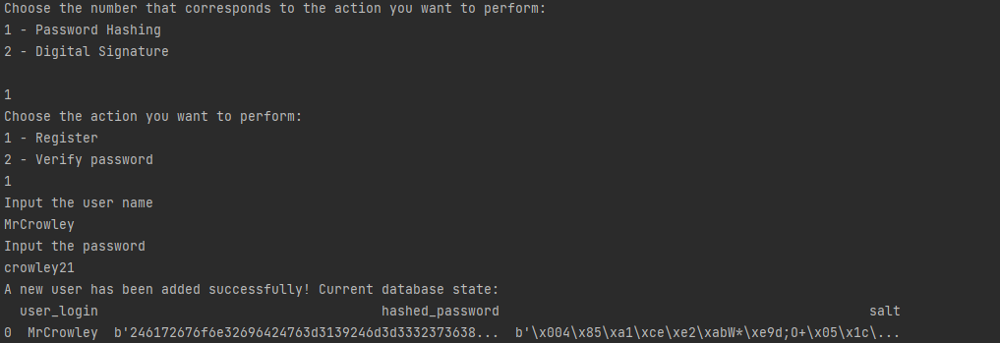
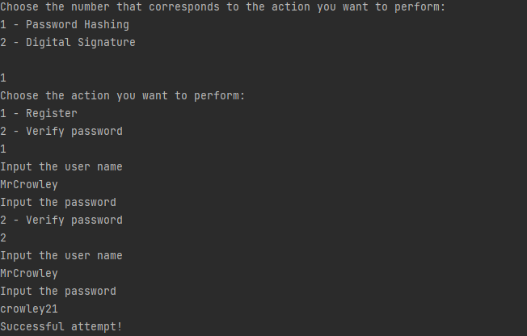
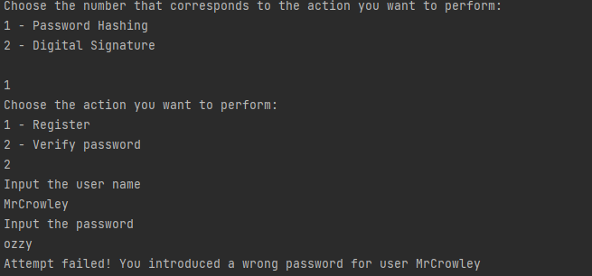
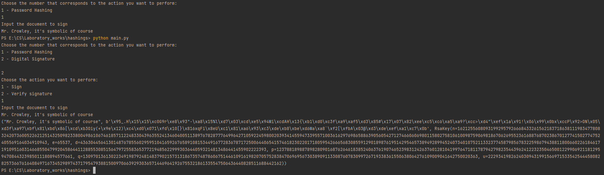
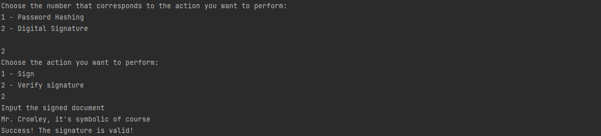

# Topic: Hash functions and Digital Signatures.

### Course: Cryptography & Security
### Author: Graur Elena

----

## Theory
&ensp;&ensp;&ensp; Hashing is a process of converting a given data (as a rule, key) into another 
value. For this purpose, hash functions are used. \
&ensp;&ensp;&ensp; Hash functions are mathematical functions that convert a numerical input value 
into another compressed numerical value. Therefore, the input of such function may be of arbitrary
length, while the output is always of the same length (individual for each used algorithm, of 
course). \
&ensp;&ensp;&ensp; In cryptography, hashing is used as one-way function meaning that it is 
impossible to recover the initial data from a hash. Therefore, the best way of retrieving the 
initial information of a hash is using the bruteforce, the collision attack or second-preimage 
attack. \
&ensp;&ensp;&ensp; One of the fields hash functions are used is the hashing passwords stored in the
database. It is quite obvious that storing passwords in plaintext is a major cybersecurity fault, 
since if the malicious individuals get access to the data, they get the key to the one's system 
and, since the vast majority of people reuse the passwords - they get access to a large amount of 
data. The most common algorithms for password hashing are the MD5, Argon2, Bcrypt, mostly due to 
the presence of the salt(an additional input to a hash function).
&ensp;&ensp;&ensp; Another interesting using of hash functions are in digital signature. On broad 
terms, digital signatures are used to demonstrate the authenticity of the person that digitally 
signed a digital message or document. The algorithm on its core is pretty simple:the document the 
one wants to sign is hashed using a hashing function. Then, the resulted hash is encrypted with an 
asymmetric using the one's private key. In order to verify the authentication of the digital 
signature, the receiver decrypt the has using the signer public key. In the same time, he/she hash 
the signed document, using the same hash function as the sender. The last step to confirm the 
signer identity is to compare the result from the decryption with the one from hashing. If the two 
values are the same, the authenticity is proven, over-wise - it is not.


## Objectives
1. Get familiar with the hashing techniques/algorithms;
2. Use an appropriate hashing algorithms to store passwords in a local DB;
3. Use an asymmetric cipher to implement a digital signature process for a user message:
    1. Take the user input message;
    2. Preprocess the message, if needed;
    3. Get a digest of it via hashing;
    4. Encrypt it with the chosen cipher;
    5. Perform a digital signature check by comparing the hash of the message with 
       the decrypted one.

   
## Implementation description
&ensp;&ensp;&ensp; The main task for this laboratory work was to get familiar with hash functions. 
In order to achieve this, there was proposed to implement two usages of these functions, as follows:
* Hashing passwords to store them in the local database;
* Digital Signature.


&ensp;&ensp;&ensp; The implementation of the tasks listed above is located in _hashing_ directory. 
Notice the fact that the used asymmetric cipher algorithm class is located in the dedicated directory
in _asymmetric_ciphers_ folder in _ciphers_ directory. \
&ensp;&ensp;&ensp; As in previous laboratory works, there is a _Control_ class that describes the 
user's interaction with the system. Despite previous times, it contains a new method 
_perform_activity()_, which returns the name of the function should be used as the programs implemented
for this laboratory work has different goals. The '([' combination and the '~' sign was used to replace
the original '(' and '=' sign, respectively, as they are less likely to be met in the input data.

````python
def perform_activity(self, action, activity):
    if action == 1:
        print('Input the user name')
        user_name = input()
        print('Input the password')
        password = input()
        if activity == 1:
            return f'insert_new_password([user~{user_name} / password~{password}])'
        else:
            return f'verify_user_password([user~{user_name} / input_password~{password}])'
    elif action == 2 and activity == 1:
        print('Input the document to sign')
        document = input()
        return f'digital_sign_document([document~{document}])'
    elif action == 2 and activity == 2:
        print('Input the signed document')
        document = input()
        return f'verify_digital_signature([document~{document}])'
````

##### Storing hashed passwords
&ensp;&ensp;&ensp; First usage of the hash functions to be discussed is storing of hashed passwords. There are two main
components of this implementation, that are stored in different classes _DataBaseManipulator_ and
_PasswordHashing_, respectively. The _DataBaseManipulator_ is responsible for communication with
the database, having the following main responsibilities: 
* creating in-memory database connection:
* inserting data into database
* extracting data from the database

Once the class is initialized, the in-memory database connection is performed automatically such
as it keeps the previously inserted information even after closing connection.

````python
def __create_connection(self):
    connection = None
    try:
        connection = sqlite3.connect("file::memory:?cache=shared", uri=True)
        return connection, connection.cursor()
    except Error as e:
        print(e)
````

&ensp;&ensp;&ensp; The database store three fields, that are the username (use himself/herself), his/her password and
the salt used for hashing, which will be explained lately. To insert a new data, the username and
the password should be specified. \
&ensp;&ensp;&ensp; The proses of hashing the password is performed at the data insertion, where the
hash of the password and the salt are generated.

````python
def insert_data(self, login, password):
    salt, hashed_password = password_hashing.hash_password(password)
    self.cursor.execute('''INSERT INTO Users_table (user_login, hashed_password, salt)
                    VALUES
                    (?, ?, ?)
                    ''', (login, hashed_password, salt))
    self.connection.commit()
````

&ensp;&ensp;&ensp;  To extract the data, only the username should be specified. The query returns the salt and the
hashed password kept in the database.

````python
def extract_data(self, login):
    self.cursor.execute('''SELECT salt, hashed_password FROM Users_table
                            WHERE user_login = ?''', (login,))
    salt, hashed_password = self.cursor.fetchall()[0]
    return salt, hashed_password
````

&ensp;&ensp;&ensp;  The _PasswordHashing_ class contains two methods: _hash_password()_, 
_verify_password_. In order to perform the hashing, it was used the Argon2 algorithm. For convenience,
the _argon2_ library provided by Python was used. \
&ensp;&ensp;&ensp;  As it was specified in the theory part, the Argon2
algorithm is one of those who needs a salt to perform the hashing process. Basically, the salt is a 
random string of a specific length that is added at the end of the input data before hashing. Therefore,
the first thing in the _hash_password()_ method is salt generation as a sequence of 32 bytes. The next,
the _argon2_ method is called and the password (transformed in bytes) is encoded. The function returns
the hashed password itself and the salt, that will be stored in the database to be used in hashing
the input text when the verification will be performed. On broad terms, it is a common practice to 
store the sale in the database alongside with the hashed password.

````python
def hash_password(self, password):
    salt = b'\x00' + secrets.token_bytes(32) + b'\x00'
    hashing = argon2.hash_password(time_cost=16, memory_cost=2 ** 15, parallelism=2, hash_len=32,
                                    password=bytes(password, encoding='utf-8'), salt=salt,
                                    type=argon2.low_level.Type.ID)
    hashed_password = binascii.hexlify(hashing)
    return salt, hashed_password
````

&ensp;&ensp;&ensp;  In the _verify_password()_ method the new input password is hashed as in the
method described above. After that, the comparison between the current hashed password and the one
stored in the database is performed. The method returns _True_ if the values are the same and 
_False_ overwise.

````python
def verify_password(self, password, salt, hashed_password):
    hashing = argon2.hash_password(time_cost=16, memory_cost=2 ** 15, parallelism=2, hash_len=32,
                                            password=bytes(password, encoding='utf-8'), salt=salt,
                                            type=argon2.low_level.Type.ID)
    current_hashed_password = binascii.hexlify(hashing)
    if hashed_password == current_hashed_password:
        return True
    else:
        return False
````

&ensp;&ensp;&ensp;  There is one more class, _PasswordStorage_ class that is just a mediator between
the classes described above, calling the necessary methods to perform insertion or verification
processes and communicate the results to the user.

````python
def insert_new_password(self, user, password):
    self.data_base.insert_data(user, password)
    print('A new user has been added successfully! Current database state:')
    database_state = self.data_base.output_data()
    return database_state
````

````python
def verify_user_password(self, user, input_password):
    salt, hashed_password = self.data_base.extract_data(user)
    verification = password_hashing.verify_password(input_password, salt, hashed_password)
    if verification:
        return f'Successful attempt!'
    else:
        return f'Attempt failed! You introduced a wrong password for user {user}'
````

##### Digital Signature
&ensp;&ensp;&ensp;  Another program that should be implemented is the Digital Signature. The steps
of the algorithm are specified in the theory part, so in the next section only the meaningful code 
will be discussed.  
&ensp;&ensp;&ensp;  As it was mentioned, for Digital Signature an asymmetric cipher is needed. For
this laboratory work, the RSA was chosen. Notice that the cipher implementation was not the goal 
of this laboratory work, so you may skip the part describing it and go directly [here](#digital-signature-implementation).
##### RSA Cipher
&ensp;&ensp;&ensp;  To implement the RSA encryption and decryption processes it was decided to use
the algorithm provided by the _cryptodomex_ library, in order to ease the overall implementation.
&ensp;&ensp;&ensp;  As in other public cryptography ciphers, the first step in this algorithm is 
the keys generation. First, the private key is generated, the public one being built on it.

````python
def __generate_keys(self):
    private_key = RSA.generate(self.length)
    public_key = private_key.public_key()
    return public_key, private_key
````

&ensp;&ensp;&ensp;  The other methods provided by _RSACipher_ class are _encrypt()_ and _decrypt()_.
The basic steps there are the same: the PKCS1_OAEP module, RSA encryption protocol, is initialized,
then the data is either encrypted or decrypted (depending on the function called). The question that
may appear here is regarding the keys used in encryption and decryption. In the classic algorithm,
the public key is used for encryption, while the private one - for decryption. In case of Digital
Signature, the keys should be reverse. As the library does not allow the decryption with the
public key, the modifications in the library source code were performed to allow the manipulations.

````python
def encrypt(self, plaintext):
    encryptor = PKCS1_OAEP.new(self.private_key)
    ciphertext = encryptor.encrypt(bytes(plaintext, encoding='utf-8'))
    return ciphertext, self.public_key
````

````python
def decrypt(self, ciphertext, public_key):
    try:
        encryptor = PKCS1_OAEP.new(public_key)
        plaintext = encryptor.decrypt(ciphertext).decode('utf-8')
        return plaintext
    except:
        return 'Non-valid digital signature'
````

##### Digital Signature implementation
&ensp;&ensp;&ensp;  The _DigitalSignature_ class has three methods: ___hash_data()_, that hashes the data, 
_digital_sign_document()_, that creates the digital signature, and _verify_digital_signature()_, 
that verifies either the signature is valid or not.
&ensp;&ensp;&ensp;  In order to perform the digital signing process, the _SHA-256_ hash function was
chosen. The ___hash_data()_ method encodes the input document (for convenience being limited to a
string) and hashes the encoded value. The obtained hash is returned.

````python
def __hash_data(self, data):
    hashing = sha256(data.encode('utf-8')).hexdigest()
    return hashing
````

&ensp;&ensp;&ensp;  The _digital_sign_document()_ method hashes the input data, Then the hash is 
encrypted using the RSA algorithm. As public keys are objects, they are stored in a dictionary to
a corresponding text value, to be used in the verification process.

````python
def digital_sign_document(self, document):
    hashed_document = self.__hash_data(document)
    encrypted_hashing, public_key = self.rsa.encrypt(hashed_document)
    self.documents_keys[document] = [encrypted_hashing, public_key]
    return document, encrypted_hashing, public_key
````

&ensp;&ensp;&ensp;  And the last but not the least method is the signature validation. First, it
hashes the received document. After this, it decrypts the ciphertext and compares the two values
in order to validate or not the signature.

````python
def verify_digital_signature(self, document):
    hashed_document = self.__hash_data(document)
    try:
        decrypted_hashing = self.rsa.decrypt(self.documents_keys[document][0], self.documents_keys[document][1])
        if hashed_document == decrypted_hashing:
            return f'Success! The signature is valid!'
        else:
            return f'Not a valid signature'
    except KeyError:
        print('Not such document was signed')
````

## Results
&ensp;&ensp;&ensp; In this section, it will be provided an example of how each program
described above works and what output it gives. As the input data, it will be used _benkyo ni narimashita_** as 
the plaintext for _Elliptic Curve ElGamal_ cipher. \
* 'MrCrowley', 'mrcrowley21' as the username and password for storing hashed password program for
both registration and valid verification; for a non-valid verification 'ozzy' password will be used;
* 'Mr. Crowley, it's symbolic of course'* for Digital Signature input.

&ensp;&ensp;&ensp; The obtained results are the following:
* Hashed password storage




* Digital Signature





## Conclusions
&ensp;&ensp;&ensp; Hash functions are concepts used nowadays in cryptography alongside the symmetric
and asymmetric ciphers. Their specific, as it could be observed during this laboratory work, is 
representing a string as another string of specific length. As mentioned, they are one way 
functions and almost impossible to retrieve the initial data from the hash, that is why in case of 
both password storing and Digital Signature, the hashes are compared. Nonetheless, hash function
is the concept that should be known as in recent years it is widely used in different fields.

____
*_Mr. Crowley, it's symbolic of course_ - (phrase from song) https://spoti.fi/3gkXrtC