# Topic: Web Authentication & Authorisation.

### Course: Cryptography & Security
### Author: Graur Elena

----

## Overview
&ensp;&ensp;&ensp; _Authentication_ and _Authorization_ are two important processes to 
protect users and information in the context ofa system. Even if these concepts are usually
use interchangeably, they are quite different and have different roles. Basically, to
know the difference and what each of them does, you should know the purpose of each of 
them. _Authentication_ tends to answer to the question _Who is the user?_, while 
authorization - _What can the user do?_. \
&ensp;&ensp;&ensp; Historically, _authentication_ is determined using a username and a 
password. However, nowadays, it commonly relies on three classes of information:
* what you know;
* what you possess;
* what you are.

&ensp;&ensp;&ensp; Here the concept of _Multi-factor Authentication_ (MFA) comes in.
Rather than just asking for a username and password, MFA requires one or more additional
verification factors, which decreases the likelihood of a successful cyber attack. \
&ensp;&ensp;&ensp; An example of such an authentication is when the user is asked to 
introduce an one-time password (OTP), sent via SMS or email, beside the regular username 
and password. On broad terms, an OTP is a form of strong authentication that answers the 
question _Are you indeed Mr/Mrs X?_. As a rule, they are sent via SMS, being uses by
corporate networks, eBanking and other services containing sensitive data. \
&ensp;&ensp;&ensp; Although this authentication method is convenient, it is not secure 
because online identity theft – using phishing, keyboard logging, man-in-the-middle 
attacks, and other practices – is increasing worldwide. Here comes the TOTP - Time-based
One-time password. TOTP has a static seed, but a moving time-based factor, that is why
it is valid only a certain period of time, called timestep. According to the conventions, 
its value should be between 30 and 60 seconds. \
&ensp;&ensp;&ensp; Another process that was discussed earlier is the _Authorization_.
There are three main categories of authorization: _Role-Based Access Control_ (RBAC), 
_Attribute-Based Access Control_ (ABAC) and _Access Control List_(ACL). RBAC, as it may
be deduced from the name, is a model where the permissions of the user is determined based
on what role he/she possesses. ABAC is more based valuating a set of rules and policies 
to manage access rights according to specific attributes, such as environmental, system, 
object, or user information. ACL tells the operating system which users can access an object, 
and which actions they can carry out. Among all of them, definitely ACL is the least
used due to its tight area of applicability, while RBAC is the most popular due to its
simplicity in usage and security and administrative privileges it offers.


## Objectives
1. Take what is implemented at the moment from previous laboratory works and put it in a web 
service / serveral web services.
2. The services should have implemented basic authentication and MFA (the authentication factors 
on the implementer's choice).
3. The web app needs to simulate user authorization and the way you authorise user is also a 
choice that needs to be done by the implementor.
4. As services that the application could provide, it could be used the classical ciphers. 
Basically the user would like to get access and use the classical ciphers, but they need to 
authenticate and be authorized.  


## Implementation
&ensp;&ensp;&ensp; The main task of this laboratory work was to develop a web app that provides:
* simple user authentication;
* multi-factor user authentication;
* permissions in accordance with the user's authorization.

&ensp;&ensp;&ensp; The implementation of the requirements listed above are provided in _server.py_ file.
Moreover, for email management tasks, it is used the EmailManipulator class, stored in _email_sender.py_
file in _email_manipulator_ package. Also, please notice the fact that in this laboratory work where used
materials from all of tha packages and files listed in project, except _asymmetric_ciphers_, which
were kept for the project function in case of no web app wrapper. \
&ensp;&ensp;&ensp; The server is running on _Flask_ framework, which consists of a set of libraries for app
development. As, according to the studied materials, the Flask server setting is not common to wrap in a class, it
was decided to develop it without creating a separate class. For app basic authentication, it was decided to use
a Flask based solution, _flask_httpauth_ library, which provides some functionalities like authentication
checking and setting of the authentication method. The initialization of these elements are provided below.

````python
app = Flask(__name__)
auth = HTTPBasicAuth()
````

The client requests were simulated using Postman.

&ensp;&ensp;&ensp; Also, for convenience, it was decided to keep the users' information into a dictionary, instead
of a real database. In the same manner are kept the roles the exists in the system.

````python
users = {}
roles = {"unknown": {"access_list": []},
         "victorian": {"access_list": ['Caesar Cipher with Permutation', 'Bifid Cipher', 'Playfair Cipher',
                                       'Vigenere Cipher']},
         "millennial": {"access_list": ['Caesar Cipher with Permutation', 'Bifid Cipher', 'Playfair Cipher',
                                        'Vigenere Cipher', "DES", "Grain Cipher"]}}
````

Moreover, as the scope of this laboratory work is to familiarize with authorization and authentication, it was decided to
simplify the data manipulating process by considering some data predefined , defined by the user or output as a 
response to the user.

&ensp;&ensp;&ensp; The app gives the opportunity tu register users. The input data required for registration is:
* username;
* password;
* email;
* role.

It is checked the user with duplicate usernames not to exist, therefore it is not possible to use the username the 
have been used previously. The password is hashed (using the algorithm implemented in previous laboratory work) and
kept in the database, along with the random generated hash. Due to the existence of the salt in the used argon2 
algorithm, it is possible two different users to have the same password.

````python
@app.route('/register', methods=['POST'])
def register_user():
    user_info = request.json
    try:
        username = user_info["username"]
        password = user_info["password"]
        email = user_info["email"]
        role = user_info["role"]
        if not (username in users):
            salt, hashed_password = password_hashing.hash_password(password)
            users[username] = {'salt': salt, 'password': hashed_password, 'email': email, 'role': role}
            logging.info(f'{users}')
            return 'The user has been successfully registered!'
        else:
            logging.warning(f'Duplicate username')
            return 'User with this username already exists. Please, choose another username!'
    except:
        logging.warning(f'Wrong registration format')
        return f'Wrong data for user registration!'
````

&ensp;&ensp;&ensp; As it was specified in the condition, the app provides a basic authentication to the user, where
the Flask _HTTPBasicAuth_ is used. Also, it was implemented a password verification function, based on which, the
authentication of the user is confirmed or not. It was used the password verification developed in the last laboratory
work.

````python
@auth.verify_password
def verify_password(username, password):
    if username in users and \
            password_hashing.verify_password(password, users.get(username)['salt'], users.get(username)['password']):
        return username
````

&ensp;&ensp;&ensp; For the basic login, the user simply introduces his/her username and password. After this, an
basic authentication token is generated and given as response.

````python
@app.route('/basic_login', methods=['POST', 'GET'])
def login_basic():
    if request.method == 'POST' or request.method == 'GET':
        user_details = request.json
        username = user_details["username"]
        password = user_details["password"]
        if username in users:
            basic_token = b64encode(f"{username}:{password}".encode('utf-8')).decode("ascii")
            headers['Authorization'] = basic_token
            return jsonify({username: basic_token})
        else:
            logging.warning(f'No valid user')
            return jsonify(f'Invalid data provided')
````

The Postman service provides the authentication simulation in _Authorization_ field, but it was decided to generate
the authentication token by the developed server and manually include it in the headers. Therefore, the login 
request gives as response the current user's username and the authentication token.

&ensp;&ensp;&ensp; For the multi-factor authentication, it was decided to develop a two-factor authentication 
based on the basic authentication and the Time-Bsed One_Time password, that are sent over email. Therefore, the
first step in the developed MFA is to perform the basic login. After the user has successfully passed the first
login, he/she is redirected to the second one, where the code sent via email should be introduced in order to validate
the user's identity and sing in the app.

````python
@app.route('/multi_factor_login', methods=['POST'])
def login_mfa():
    user_details = request.json
    username = user_details["username"]
    password = user_details["password"]
    basic_auth_token = requests.get('http://192.168.0.26:8080/basic_login',
                                    json={'username': username, 'password': password}).json()
    print(basic_auth_token)
    if basic_auth_token[username]:
        user = users[username]
        generate_otp_code(username)
        while not ('otp_auth' in users[username]) or user['otp_auth']['validation'] is None:
            pass
        if user['otp_auth']['validation']:
            return jsonify({username: basic_auth_token[username]})
        else:
            return jsonify(f'Logging attempt failed')
    else:
        logging.warning(f'No valid user')
        return jsonify(f'Invalid data provided')
````

In the OTP login, only the received code is expected to check it with the sent code and determine weather the  
identity of the user is confirmed or not.

````python
@app.route('/otp_login/<username>', methods=['POST'])
def login_otp(username):
    secret_code = users[username]['otp_auth']['secret']
    data = request.json
    otp_data = data['otp']
    if pyotp.TOTP(secret_code, interval=180).verify(otp_data):
        users[username]['otp_auth']['validation'] = True
        return jsonify(f'Logged in successfully')
    else:
        users[username]['otp_auth']['validation'] = False
        return jsonify(f'Invalid data provided')
````

In order to generate the TOTP and initialize the OTP authentication data into the database, a help function was created.

````python
def generate_otp_code(username):
    secret_code = pyotp.random_base32()
    totp = pyotp.TOTP(secret_code, interval=180)
    code = totp.now()
    email_manipulator.send_email(users.get(username)["email"], code)
    users[username]['otp_auth'] = {'secret': secret_code, 'validation': None}
    return secret_code
````

On the normal base, this data is not kept in the database and user is redirected to the page with the TOTP seed in.
Due to the absence of the client side as in web form, it is difficult to impossible to perform this task, that
is why it was decided to keep this data in the database.

&ensp;&ensp;&ensp; The email are sent with SMTP protocol, using a python library. The security is provided by TLS.

````python
@staticmethod
def send_email(receiver_email, otp):
    try:
        smtp = smtplib.SMTP('smtp.gmail.com', 587)
        smtp.starttls()
        smtp.login("sender_mail", "code")
        sender = "sender_mail"
        receiver = receiver_email
        msg = MIMEMultipart('alternative')
        msg['Subject'] = "Your OTP"
        date = datetime.datetime.now().strftime("%Y-%m-%d %H:%M:%S")  
        html = """\
        <html>
          ...  # here is described the HTML of the message
        """ % (date, otp)
        text = MIMEText(html, 'html')
        msg.attach(text)
        smtp.sendmail(sender, receiver, msg.as_string())
        smtp.quit()
        logging.info(f"Email sent successfully!")
    except Exception as ex:
        logging.info(f"Something went wrong....", ex)
````

&ensp;&ensp;&ensp; As the user is authenticated, he/she has access to the list of ciphers he/she may use. Basically,
there is provided an authorization based on authentication: unauthenticated users are not allowed to perform 
any action in the server, except registration and login. \
&ensp;&ensp;&ensp; As it was mentioned previously, users have roles that correspond to the ones submitted at 
registration. As it follows, the used authorization method is the RBAC. The permissions of the users are described
as the ciphers they may use within the app. These permissions may be viewed on the same address as the address the
cipher may be applied. Please, notice that for these URLs the login is required.

````python
@app.route('/encryption_algorithms', methods=['GET', 'POST'])
@auth.login_required
def get_ciphers():
    if request.method == 'GET':
        if users[auth.current_user()]['role'] in roles:
            return jsonify(f'Available ciphers: {roles[users[auth.current_user()]["role"]]["access_list"]}')
        else:
            return jsonify({'Available ciphers': None})
    elif request.method == 'POST':
        choice = request.json
        cipher_name = choice["cipher"]
        if cipher_name == 'DES':
            return redirect(url_for('perform_des'), code=307)
        elif cipher_name == 'Grain Cipher':
            return redirect(url_for('perform_grain'), code=307)
        elif cipher_name == 'Caesar Cipher with Permutation':
            return redirect(url_for('perform_caesar'), code=307)
        elif cipher_name == 'Bifid Cipher':
            return redirect(url_for('perform_bifid'), code=307)
        elif cipher_name == 'Playfair Cipher':
            return redirect(url_for('perform_playfair'), code=307)
        elif cipher_name == 'Vigenere Cipher':
            return redirect(url_for('perform_vigenere'), code=307)
````

&ensp;&ensp;&ensp; After a cipher is chosen, user is redirected to the URL of that cipher where it is checked is he/she has access to
it. The selected action is performed in case of an authorized user and returned with a suggestive message otherwise.
All cipher managing URLs has a common structure: unwrap the action to be performed and the data like keys or text 
to feed the input into the cipher class.

````python
@app.route('/Caesar_permutation_cipher', methods=['POST'])
@auth.login_required
def perform_caesar():
    if "Caesar Cipher with Permutation" in roles[users[auth.current_user()]['role']]["access_list"]:
        choice = request.json
        operation = choice["operation"]
        key = choice["key"]
        shift_key = choice["shift_key"]
        text = choice["text"]
        return perform_cipher_operation(operation, CaesarCipherPermutation, [key, shift_key, text])
    else:
        return jsonify(f'Unauthorized access')
````

As the action selecting and performing had the same structure for all the implemented ciphers, it was decided
to build a help function which would select the right function and pass the arguments to it.

````python
def perform_cipher_operation(operation, cipher, parameter_list):
    if operation == 'Encrypt':
        result = cipher(*parameter_list).encrypt_text()
    else:
        result = cipher(*parameter_list).decrypt_text()
    return jsonify({'Result': result})
````

## Results
&ensp;&ensp;&ensp; In this section, it will be provided an example of how each program described above works 
and what output it gives. It will be shown the process how a user may use some ciphers provided by the app.

* In the first step, the user is registered. 

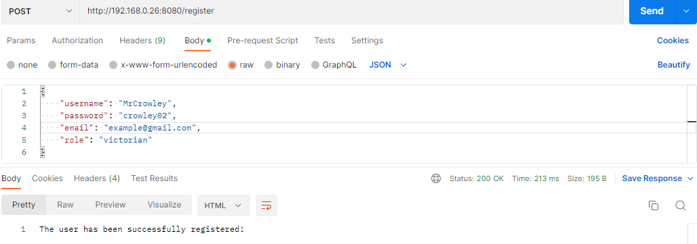

* The next step is to sign in into the app. As follows, it will be shown the login via the basic 
authentication and via the MFA authentication. \
For the basic login, the user just provides the required data and if it is the correct one,  he/she 
logges into the application.

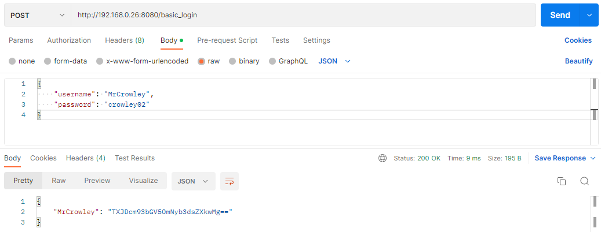

In case of MFA authentication, the user provides the same data and the process looks very similar to
the one in basic authentication. The exception is the fact that data is not provided right away. 
After sending the request, the page looks like the one provided below.

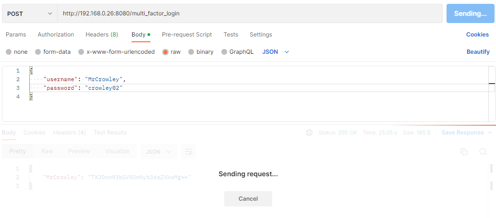

In the same time, in the logging appears a notification that the email with OTP code was sent.

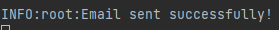

An ordinary email that is sent looks like this.

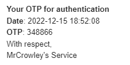

Then, the received OTP should be sent to the server to confirm the identity. If it is the right code,
the message of successfully logging in will be output, as well as the basic token in the MFA 
authentication URL.

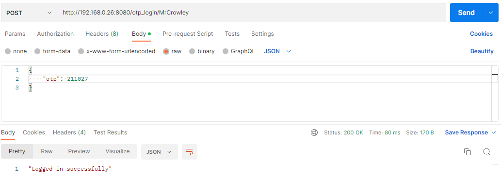

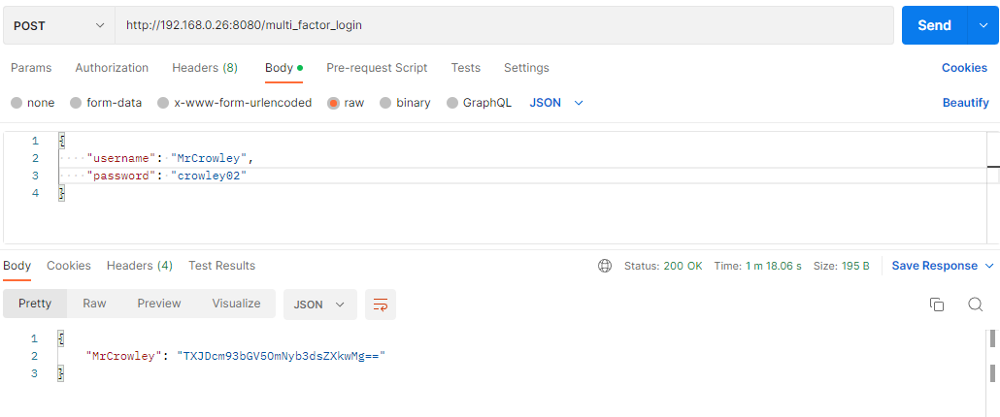

In case the attempt of login is not successful, whe corresponded messages would be output without 
given any clue about the authentication token.

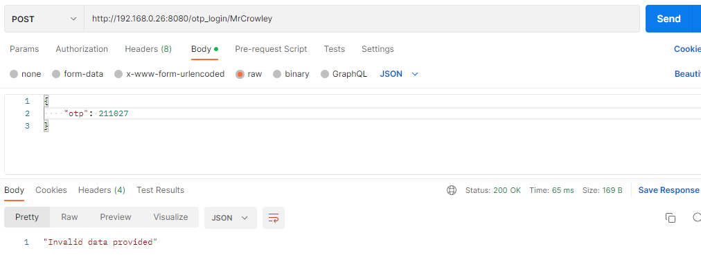


* As the user is already authenticated, the received token should be added in the list of request 
headers.

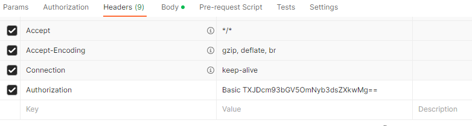

* If the user is logged in, he/she may view the list of ciphers he/she is eligible to perform.


* The next step is trying to use ciphers themselves. \
In case user tries to perform any of ciphers in the provided list, he/she will be allowed to do so.

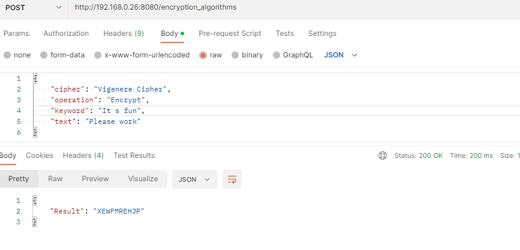

However, in case he/she tries to perform a cipher he/she does not have access to, a corresponded
denial message will be output.

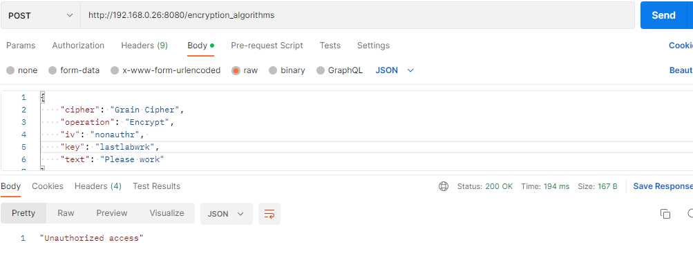

To show it is working, there will be created another user with another level of access.

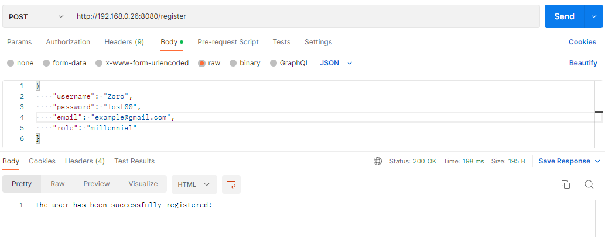


After successfully logging in, user access the list of the ciphers that are available to him/her.


As the permissions allows it, he/she may perform the actions the previous user with another role
could not.

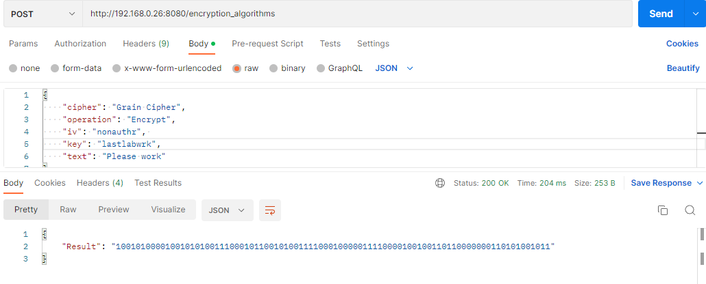


## Conclusion
&ensp;&ensp;&ensp; Authentication and Authorization are two key concepts of the basic
security of different systems. This laboratory work provided a better 
understanding of the essence of each of them and of the fact that, While often used 
interchangeably, authentication and authorization represent fundamentally different 
functions. Nonetheless, the tasks gave a better perception of the importance of
these methods, as well as of their evolution (basic authentication -> MFA) in 
app's security maintenance.

____
*_Mr. Crowley_- main character of the provided song: https://spoti.fi/3gkXrtC